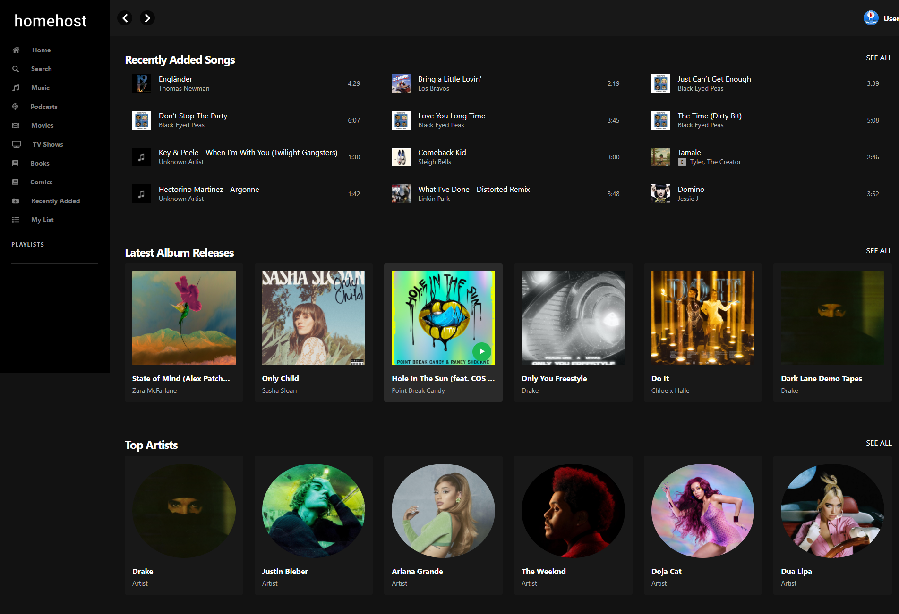

<!--<p align="center">
  
</p>
-->
<h1 align="center">🏠 HomeHost</h1>

<p align="center">
  <strong>Servidor multimedia moderno para streaming de películas, series y música dentro de tu red local.</strong>
</p>

<p align="center">
  Desarrollado por <b>Isai Reyes</b>
</p>

<p align="center">
  
  
  
  
</p>

---

# 📖 Descripción

**HomeHost** es una plataforma multimedia self-hosted diseñada para transmitir tu colección personal de:

- 🎥 Películas
- 📺 Series
- 🎵 Música

directamente desde tu computadora o servidor hacia cualquier dispositivo conectado dentro de tu red local mediante una interfaz web moderna y rápida.

---

# ✨ Características

## 🎥 Películas

- Biblioteca organizada automáticamente
- Búsqueda inteligente
- Portadas y metadata automática
- Géneros y recomendaciones
- Películas populares y mejor calificadas

---

## 📺 Series

- Organización automática por temporadas
- Reproducción de episodios
- Metadata enriquecida desde TMDb
- Navegación moderna tipo streaming platform

---

## 🎵 Música

- Álbumes y artistas
- Streaming FLAC y MP3
- Integración con Spotify API
- Búsqueda avanzada
- Portadas automáticas
- Reproducción instantánea

---

# 🖼️ Capturas de pantalla

## 🎥 Películas


---

## 🔎 Buscador


---

## 📺 Series


---

## 🎵 Música



---

# 🛠️ Tecnologías utilizadas

<p align="center">


</p>

---

# ⚙️ Instalación

## 🔹 Clonar el repositorio

```bash
git clone https://github.com/isairey/PlataformaMultimedia.git
cd PlataformaMultimedia
```
## 🔹 Instalar dependencias
```
npm run install-packages
```
## 🔹 Configurar variables de entorno

Crear los archivos .env necesarios:

### CLIENT
```
REACT_APP_HOMEHOST_BASE="http://localhost:5000"
REACT_APP_IMAGE_BASE="https://image.tmdb.org/t/p/"
REACT_APP_IMDB_BASE="https://www.imdb.com"
```
### SERVER
```
TMDB_KEY="YOUR_TMDB_KEY"

SPOTIFY_CLIENT_ID="YOUR_CLIENT_ID"
SPOTIFY_CLIENT_SECRET="YOUR_CLIENT_SECRET"

MOVIES_PATH="/path/to/movies"
TV_PATH="/path/to/tv"
MUSIC_PATH="/path/to/music"

DATABASE_URL="file:./data/media.db"

CLIENT_BASE_URL="http://localhost:3000"
```

---

# 🚀 Ejecutar la aplicación

Desarrollo
```
npm run start
Puertos por defecto
Servicio	Puerto
Client	3000
Server	5000
Producción
npm run start:prod
```

## 🗄️ Base de datos

Crear migraciones
```
npm run db:migrate
Explorar base de datos
npm run db:browse
```

Abrir:
```
http://localhost:5555
```
Limpiar base de datos
```
npm run db:clear
```

# 📂 Organización multimedia
```
🎥 Películas
Movies/
 └── Movie Name <TMDB-ID>.mkv
📺 Series
TV/
 └── Show Name <TMDB-ID>/
      └── S01E01 Episode.mkv
🎵 Música
Music/
 └── Album Name <Spotify-ID>/
      └── 01 Song.mp3

```

---

# 🌐 API Routes

🎥 Películas
GET /api/movies
GET /api/movies/:id
GET /api/movies/genres
GET /api/movies/random
📺 Series
GET /api/tv
GET /api/tv/:id
GET /api/tv/genres
🎵 Música
GET /api/music/albums
GET /api/music/artists
GET /api/music/songs
🐳 Docker
Ejecutar rápidamente con Docker
docker compose up

---

# 📊 Roadmap

- Aplicación móvil Android/iOS
- Descarga offline
- Multiusuario
- Streaming remoto
- Integración con Chromecast
- Sistema de recomendaciones
- Temas personalizados
- Aplicación de escritorio

 ---
 
# 🤝 Contribuciones

Las contribuciones son bienvenidas.

```
git checkout -b feature/nueva-funcion
git commit -m "Nueva funcionalidad"
git push origin feature/nueva-funcion
```

Luego abre un Pull Request 🚀

---

# 👨‍💻 Autor

<p align="center">  </p> <p align="center"> <b>Isai Reyes</b> </p> <p align="center"> Desarrollador Full Stack apasionado por el streaming multimedia, servidores self-hosted y aplicaciones modernas. </p>
